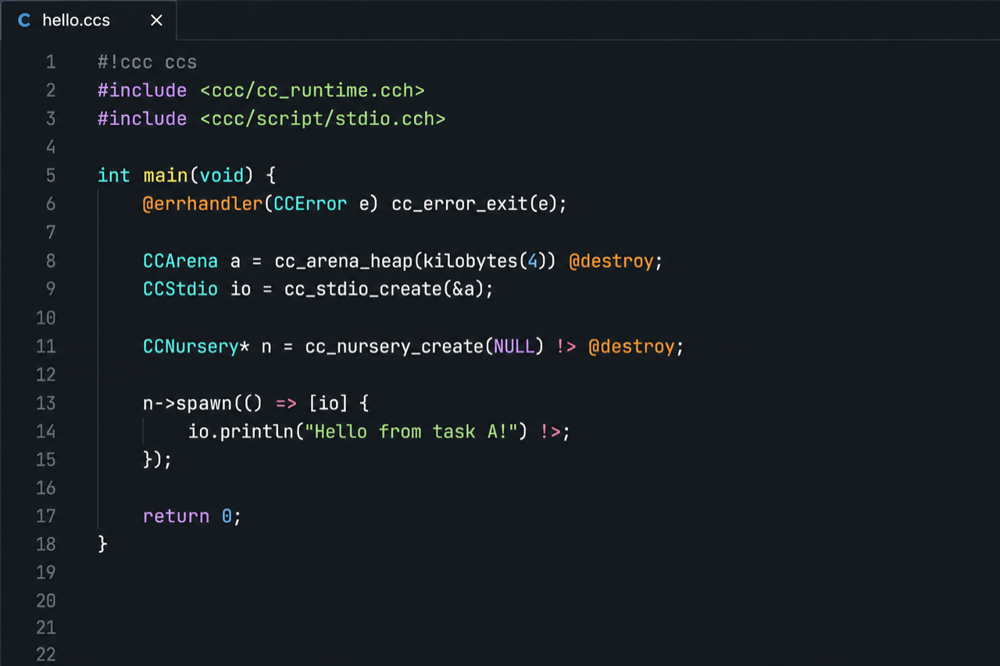

# Concurrent-C

**[github.com/sreekotay/concurrent-c](https://github.com/sreekotay/concurrent-c)**

Syntax highlighting for Concurrent-C in VS Code and Cursor.

Concurrent-C is a **strict C11-superset**: `.ccs` lowers to plain C and compiles with your host C compiler. This extension colors the extra surface — `@` keywords, result unwrap, UFCS, templates, `@emit`, and `@grammar` fences — on top of ordinary C.



## Install

Search **Concurrent-C** in the Extensions view (`⇧⌘X`), or:

```bash
code --install-extension sreekotay.concurrent-c-syntax
# Cursor:
cursor --install-extension sreekotay.concurrent-c-syntax
```

Open a `.ccs`, `.cch`, or `.shcc` file. Language mode should read **Concurrent-C**.

The [language toolchain](https://github.com/sreekotay/concurrent-c#install) (`ccc`) is separate — this extension is highlighting and editor basics only.

## Languages

| Suffix | Role |
|--------|------|
| `.ccs` | Concurrent-C source |
| `.cch` | Concurrent-C headers |
| `.shcc` | Concurrent-C scripts (same language; outside the `.ccs` / `.cch` pair) |

Files associate automatically. Breakpoints are enabled for the language (pair with [CodeLLDB](https://marketplace.visualstudio.com/items?itemName=vadimcn.vscode-lldb) to debug a `ccc -g` binary).

## What it highlights

C11 and the preprocessor, plus Concurrent-C’s active syntax:

```c
#!ccc ccs
#include <ccc/cc_runtime.cch>
#include <ccc/script/stdio.cch>

int main(void) {
    @errhandler(CCError e) cc_error_exit(e);

    CCArena a = cc_arena_heap(kilobytes(4)) @destroy;
    CCStdio io = cc_stdio_create(&a);
    CCNursery* n = cc_nursery_create(NULL) !> @destroy;

    n->spawn(() => [io] {
        @errhandler(CCError e) cc_error_exit(e);
        io.println("Hello from task A!") !>;
    });
    n->spawn(() => [io] {
        @errhandler(CCError e) cc_error_exit(e);
        io.println("Hello from task B!") !>;
    });
    return 0;
}
```

| Surface | Examples |
|---------|----------|
| Lifecycle | `name@(args) @destroy` / `@detach`, `@defer` / `@defer(err\|ok)` / `@cancel` |
| Concurrency | `@async` / `@await` / `@blocking` / `@nonblocking`, `n->spawn(...)` |
| Results | `@errhandler` / `@err`, unwrap `!>` / `?>`, types `T!>(E)` |
| Methods | UFCS `value.method(...)` / `ptr->method(...)` |
| Types | `T[:]`, `T[:!]`, `T[~N 1:N >]`, `Name::[args]` |
| Literals | `10ms`, `=>`, `..` |
| `@string` | backtick templates: `${…}`, `$~tag{…}`, `${{…}}` verbatim |
| `@emit` | backtick bodies highlighted as Concurrent-C/C, with `${…}` interpolations |
| `@grammar` | `@grammar(engine) Name {~~~~ … ~~~~}` (`rules` / `schema` / `cli`) |
| Variants | `@variant` / `@variant(packed)` |

Comments, brackets, and auto-closing pairs follow C (`//`, `/* */`, including backticks).

## Install the compiler

```bash
brew tap sreekotay/concurrent-c https://github.com/sreekotay/concurrent-c.git
brew install --HEAD sreekotay/concurrent-c/ccc
ccc run hello.ccs
```

Docs: [Getting started](https://github.com/sreekotay/concurrent-c/blob/main/docs/getting-started.md) · [Language concepts](https://github.com/sreekotay/concurrent-c/blob/main/docs/language-concepts.md) · [Cheatsheet](https://github.com/sreekotay/concurrent-c/blob/main/docs/cheatsheet.md)

## From a clone

`./cc-install.sh` copies this package into `~/.vscode/extensions` and `~/.cursor/extensions` unless you pass `--no-editor-tools`. To install only the syntax package:

```bash
./vscode/ccs-syntax/install-local.sh --both   # then: Developer → Reload Window
```

## License

MIT. Source lives in the [Concurrent-C](https://github.com/sreekotay/concurrent-c) repository under `vscode/ccs-syntax`.
