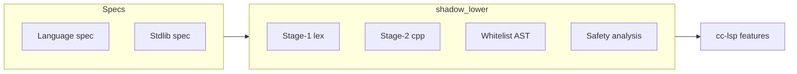

# Concurrent-C IDE roadmap

Language tooling for Concurrent-C, grounded in the normative specs:

- [`spec/concurrent-c-spec-complete.md`](../spec/concurrent-c-spec-complete.md) — surface syntax, compile-time rules, lowering
- [`spec/concurrent-c-stdlib-spec.md`](../spec/concurrent-c-stdlib-spec.md) — stdlib headers, UFCS families, factory spellings

## Current state

| Component | Path | Status |
|-----------|------|--------|
| Syntax highlighting | [`ccs-syntax/`](ccs-syntax/) | Shipped (TextMate) |
| Language server | [`cc-lsp/`](cc-lsp/) | **Phase 1: live diags (gen / debounce / nursery)** |
| Compiler front | [`cc/shadow/`](../cc/shadow/) | Production (`shadow_lower`) |
| Structured diag API | [`cc/src/diag/`](../cc/src/diag/) | Designed; not wired to native front |
| `--json-diagnostics` | — | Planned (Phase 1.5) |

The native front already produces accurate `path:line:col: error:` diagnostics. The largest gap for IDE work is a stable programmatic interface beyond spawning the CLI.

## Architecture

```text
┌─────────────────┐     LSP      ┌──────────────────┐
│  VS Code/Cursor │ ◄──────────► │  cc-lsp          │
│  ccs-syntax     │   stdio      │  (Concurrent-C)  │
│  tiny JS launch │              └────────┬─────────┘
└─────────────────┘                       │
                                 ┌────────▼─────────┐
                                 │ ccc              │
                                 │ --emit-c-only    │
                                 │ (shadow_lower)   │
                                 └──────────────────┘
```

**Principle:** the compiler is the source of truth for diagnostics and (later) semantics. Do not use clangd on lowered C as the primary semantic engine — UFCS, results, and spawn safety are erased or renamed in emission.

## Phases

### Phase 1 — Diagnostics-only LSP (done)

**Goal:** red squiggles that match `ccc` CLI output.

| Deliverable | Description |
|-------------|-------------|
| `cc_lsp.ccs` | JSON-RPC stdio server in Concurrent-C |
| Subprocess check | `ccc --emit-c-only --no-cache` |
| Stderr parser | `path:line:col: error\|warning: message` |
| Unsaved buffers | Write temp copy; publish against the editor URI |
| JS shim | `extension.js` only launches `bin/cc-lsp` |

**Not in Phase 1:** completion, go-to-def, semantic tokens, `--json-diagnostics`.

Hover on `@` sigils and `!>` / `?>` is started (static notes from the language spec).

**Install (from clone):**

```bash
cd vscode/cc-lsp
./install-local.sh --both
# Developer → Reload Window
```

Pair with [`ccs-syntax`](ccs-syntax/) for highlighting.

### Phase 1.5 — Structured compiler output

Add to `ccc` / `shadow_lower`:

```text
ccc --check [--json-diagnostics] <file>
```

- Parse through safety analysis; skip emit when `--check` alone suffices (or keep emit-c-only as fallback).
- Emit JSON array: `{ "file", "line", "column", "severity", "message", "code"? }`.
- Remove stderr regex fragility from `cc-lsp`; enable related-information and stable diagnostic codes later.

### Phase 2 — In-process parse API

Extract a C library from the shadow pipeline (not legacy `cc/src/visitor/`):

```c
int cc_shadow_parse_buffer(const char *path_for_errors,
                           const char *bytes, size_t len,
                           CCShadowParseOptions *opts,
                           CCShadowParseResult *out);
```

Enables: unsaved buffers without temp files, faster debounce, semantic tokens from whitelist AST kinds.

Expose stages incrementally:

1. Stage-1 tape (re-lex)
2. Stage-2 stitch (includes)
3. Whitelist parse + safety (diagnostics without emit)

### Phase 3 — Semantic IDE features

| Feature | Source | Notes |
|---------|--------|-------|
| Hover on `@`-sigils | Language spec §1–§8 | Static markdown |
| Hover on stdlib UFCS | Stdlib spec + `.cch` | Curated or generated |
| Completion on UFCS | `pp_emit_typehooks.cch` harvest | Needs typehook registry |
| Go-to-def on hooks | AST + mangling (`GENERIC_MANGLING.md`) | Hard |
| Find references | Cross-TU index + comptime | Very hard |
| Inlay hints | Lowered names, captures | Debug-oriented |

CC-specific semantics the LSP must eventually understand:

- UFCS + `@typehooks` (not C name lookup)
- `T!>(E)` and unwrap forms (`?>`, `!>`, `@errhandler`)
- `@spawn` / nursery / capture safety
- `@async` / `@await` legality
- Generic factories (`Vec::[T]`, `map_new::[K,V]`)
- `.cch` header units vs `.ccs` translation units
- Stage-2 include/macro stitch (same view as compiler)
- `#line`-mapped locations in user source

### Phase 4 — Spec-driven documentation layer

Treat the two spec files as a doc corpus (parallel to compiler features):

- Stdlib section → hover text for known UFCS families
- Language spec error shapes → diagnostic `code` + doc URLs
- Optional: generate completion stubs from stdlib factory signatures

## Design decisions (open)

1. **Language id** — Single `concurrent-c` for `.ccs`, `.cch`, `.shcc` (current).
2. **Diagnostic authority** — Compiler-only for v1; no hybrid clangd on lowered C.
3. **Incomplete files** — Publish what the whitelist parser recovers; no silent drop.
4. **Comptime** — Check mode may skip execution; surface “comptime not evaluated” as info when relevant.
5. **Version pins** — Respect `version=` in unit headers (same as CLI).
6. **Primary editor** — VS Code / Cursor first; LSP protocol keeps Neovim/etc. possible.

## CC-specific LSP challenges



- **UFCS** dispatch is type-driven, not lexical — completion requires hook tables.
- **Lowering erasure** — many surface names do not exist in emitted C.
- **No incremental parse today** — full re-check per debounce until Phase 2 API lands.
- **Include graph** — diagnostics on `#include`d `.cch` may reference other paths; Phase 1 publishes diags for the active document only.

## Success criteria

| Phase | Done when |
|-------|-----------|
| 1 | Opening a failing `tests/*.compile_err` fixture shows the same error in-editor as CLI |
| 1.5 | `cc-lsp` consumes JSON; no regex on stderr |
| 2 | Unsaved buffer check without temp file; check &lt; 200 ms on small TUs |
| 3 | UFCS completion on `CCArena` / `CCNursery` from typehooks |
| 4 | Hover on `cc_arena_heap` shows stdlib spec excerpt |

## References

- Compiler architecture: [`cc/shadow/README.md`](../cc/shadow/README.md)
- Diagnostic audit: [`cc/src/diag/DIAG_AUDIT.md`](../cc/src/diag/DIAG_AUDIT.md)
- Test oracles: [`tests/README.md`](../tests/README.md) (`*.compile_err`)
- Build commands: [`docs/build-when.md`](../docs/build-when.md)
